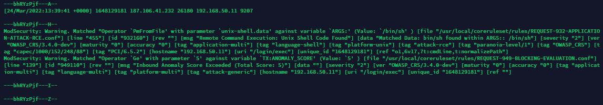
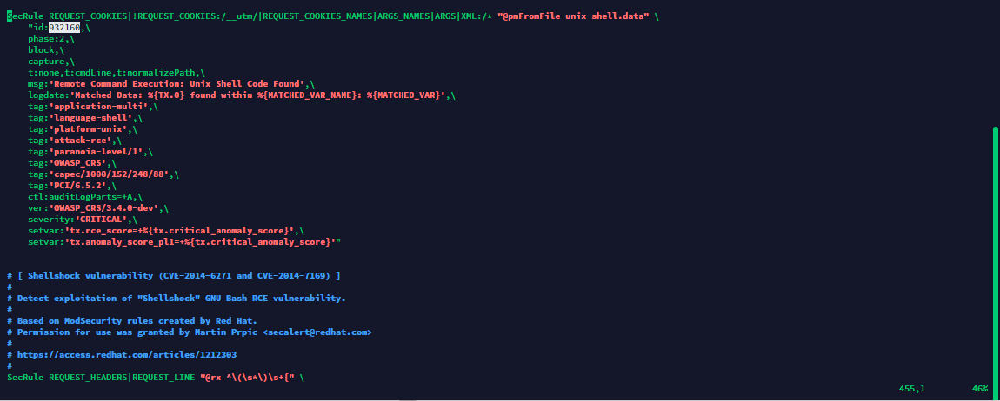

# ModSecurity with Kong

This repository has as objective to teach how to install, configure, handle false positives and test your application.

## Step 01 - Installation and activation

In our case, we'll use ModSecurity with Kong. It's installed at the moment we build the kong image, in Dockerfile. To check the Dockerfile in question, access the link below from my another repository:

[Dockerfile](https://github.com/fabiot100/kong/blob/main/build/Dockerfile)

After ModSecurity be installed, you must to activate it on Nginx (Openresty) configuration. In this case, as we use Kong, that configuration must be set at my-server.kong.conf. At server configuration, add the two ModSecurity lines, as the example below:

```conf
server {
    ...
​​​​​​​    ...
    ...
    modsecurity on;
    modsecurity_rules_file /usr/local/modsec_includes.conf;
    ...
    ...
​​​​​​​    ...
}
```

That file can be found accessing the following link from my another repository:

[Nginx (Openrest) configuration](https://github.com/fabiot100/kong/blob/main/kong/etc/kong/my-server.kong.conf)

• **NOTE** - At the Github project, you'll find the ModSecurity lines commented because these aren't in use yet. So when you clone the project and use it, you should uncomment them.

## Step 02 - Configuration

There are three files/folders where the configuration can be done. They can't be found in kong repository at Github, only inside the VM volume where Kong container runs. These files/folders are located in the Kong path:

```shell
#ModSecurity conf location:
/your/ModSecurity/volume/modsecurity.conf

#CoreRuleSet conf location:
/your/coreruleset/volume/usr/local/coreruleset/crs-setup.conf

#CoreRuleSet rules path:
/your/coreruleset/volume/usr/local/coreruleset/rules/
```

After make the properly configuration, you must to restart kong:

```shel
docker restart kong
```

### ModSecurity.conf

You can configure ModSecurity in this file. Below are some custom configurations that I've made:

```conf
# -- Rule engine initialization ----------------------------------------------

# Enable ModSecurity, attaching it to every transaction. Use detection
# only to start with, because that minimises the chances of post-installation
# disruption.
#
#SecRuleEngine DetectionOnly
SecRuleEngine On

# -- Debug log configuration -------------------------------------------------

# The default debug log configuration is to duplicate the error, warning
# and notice messages from the error log.
SecDebugLog /var/log/modsec/debug.log
SecDebugLogLevel 3

# -- Audit log configuration -------------------------------------------------

# Log the transactions that are marked by a rule, as well as those that
# trigger a server error (determined by a 5xx or 4xx, excluding 404,  
# level response status codes).
#
#SecAuditEngine On
SecAuditEngine RelevantOnly
SecAuditLogRelevantStatus "^2-5"

# Log everything we know about a transaction.
# Log only Audit Log Header; Audit log trailer, which contains additional data; Compact request body alternative (to part C), which excludes files
SecAuditLogParts AIHZ

# Use a single file for logging. This is much easier to look at, but
# assumes that you will use the audit log only ocassionally.
#SecAuditLogType Concurrent
SecAuditLogType Serial
SecAuditLog /var/log/modsec/modsec_audit.log

# Specify the path for concurrent audit logging.
#SecAuditLogStorageDir /var/log/modsec
```

And then:

```shell
docker restart kong
```

### crs-setup.conf

This is one of the rules configuration. It's an extensive file and, for now, I've just made only one configuration on it. Now it's allowed more methods than default, on line 414:

```conf
# HTTP methods that a client is allowed to use.
# Default: GET HEAD POST OPTIONS
# Example: for RESTful APIs, add the following methods: PUT PATCH DELETE
# Example: for WebDAV, add the following methods: CHECKOUT COPY DELETE LOCK
#          MERGE MKACTIVITY MKCOL MOVE PROPFIND PROPPATCH PUT UNLOCK
# Uncomment this rule to change the default.
SecAction \
 "id:900200,\
  phase:1,\
  nolog,\
  pass,\
  t:none,\
  setvar:'tx.allowed_methods=GET POST OPTIONS PUT DELETE PATCH'"
#  setvar:'tx.allowed_methods=GET HEAD POST OPTIONS'"
```

And then:

```shell
docker restart kong
```

### coreruleset/rules

First run the following command to get the files you must to edit:

```shell
grep -l 'ctl:auditLogParts=+E' *
```

After that, it'll display the files containing that option. Next, you need to change the E value to A value, like the following:

```shell
sed -i "s/ctl:auditLogParts=+E/ctl:auditLogParts=+A/" REQUEST-920-PROTOCOL-ENFORCEMENT.conf && \
sed -i "s/ctl:auditLogParts=+E/ctl:auditLogParts=+A/" REQUEST-921-PROTOCOL-ATTACK.conf && \
sed -i "s/ctl:auditLogParts=+E/ctl:auditLogParts=+A/" REQUEST-931-APPLICATION-ATTACK-RFI.conf && \
sed -i "s/ctl:auditLogParts=+E/ctl:auditLogParts=+A/" REQUEST-932-APPLICATION-ATTACK-RCE.conf && \
sed -i "s/ctl:auditLogParts=+E/ctl:auditLogParts=+A/" REQUEST-933-APPLICATION-ATTACK-PHP.conf && \
sed -i "s/ctl:auditLogParts=+E/ctl:auditLogParts=+A/" REQUEST-934-APPLICATION-ATTACK-GENERIC.conf && \
sed -i "s/ctl:auditLogParts=+E/ctl:auditLogParts=+A/" REQUEST-941-APPLICATION-ATTACK-XSS.conf && \
sed -i "s/ctl:auditLogParts=+E/ctl:auditLogParts=+A/" REQUEST-942-APPLICATION-ATTACK-SQLI.conf && \
sed -i "s/ctl:auditLogParts=+E/ctl:auditLogParts=+A/" REQUEST-943-APPLICATION-ATTACK-SESSION-FIXATION.conf && \
sed -i "s/ctl:auditLogParts=+E/ctl:auditLogParts=+A/" RESPONSE-950-DATA-LEAKAGES.conf && \
sed -i "s/ctl:auditLogParts=+E/ctl:auditLogParts=+A/" RESPONSE-951-DATA-LEAKAGES-SQL.conf && \
sed -i "s/ctl:auditLogParts=+E/ctl:auditLogParts=+A/" RESPONSE-952-DATA-LEAKAGES-JAVA.conf && \
sed -i "s/ctl:auditLogParts=+E/ctl:auditLogParts=+A/" RESPONSE-953-DATA-LEAKAGES-PHP.conf && \
sed -i "s/ctl:auditLogParts=+E/ctl:auditLogParts=+A/" RESPONSE-954-DATA-LEAKAGES-IIS.conf && \
sed -i "s/ctl:auditLogParts=+E/ctl:auditLogParts=+A/" RESPONSE-955-WEB-SHELLS.conf
```

Then, if everything works fine, run the command below again and it'll display nothing:

```shell
grep -l 'ctl:auditLogParts=+E' *
```

And the command below will display all the previews files:

```shell
grep -l 'ctl:auditLogParts=+A' *
```

And then, to apply the configs:

```shell
docker restart kong
```

## Step 03 - False positives

Some false positives must be handled for the services to work properly. So, is needed to create a file and change another. For this, follow de steps below:

1- Create the file below and insert the flollowing lines:

```shell
vim /your/coreruleset/volume/usr/local/coreruleset/rules/RESPONSE-999-EXCLUSION-RULES-AFTER-CRS.conf
```
```conf
# ModSecurity Rule Exclusion: GET or HEAD Request with Body Content
SecRuleRemoveById 920170

# ModSecurity Rule Exclusion: Request Containing Content, but Missing Content-Type header
SecRuleRemoveById 920340

# ModSecurity Rule Exclusion: HTTP Header Injection Attack via payload (CR/LF detected)
SecRuleRemoveById 921150

# ModSecurity Rule Exclusion: Illegal Content-Type header
SecRuleRemoveById 920470

# ModSecurity Rule Exclusion: Request content type is not allowed by policy
SecRuleRemoveById 920420

# ModSecurity Rule Exclusion: OS File Access Attempt
SecRuleRemoveById 930120

# ModSecurity Rule Exclusion: URL Encoding Abuse Attack Attempt
SecRuleRemoveById 920220
```

2- In the /your/ModSecurity/volume/modsecurity.conf file, comment the configuration below:

```conf
# Verify that we've correctly processed the request body.
# As a rule of thumb, when failing to process a request body
# you should reject the request (when deployed in blocking mode)
# or log a high-severity alert (when deployed in detection-only mode).
#
#SecRule REQBODY_ERROR "!@eq 0" \
#"id:'200002', phase:2,t:none,log,deny,status:400,msg:'Failed to parse request body.',logdata:'%{reqbody_error_msg}',severity:2"
```

## Step 04 - Testing

After the steps above be done, you can test if ModSecurity is activated and working properly. To do that, run in your terminal the command below:

```shell
curl https://test.com.br/?exec=/bin/bash
```

And then, if everything works fine, you'll have a 403 Forbidden returned:

```html
<html>
    <head>
        <title>403 Forbidden</title>
    </head>
    <body>
        <center>
            <h1>403 Forbidden</h1>
        <center>
    </body>
</html>
```

You can check the ModSecurity log to see the logs (it contains warnings, denials, and lots of useful information). This is very important, because based on it you can allow or deny based on the warning log.

```shell
#ModSecurity logs location:
/you/Kong/volume/var/log/modsec/modsec_access.log
```
Example:



In this case, if you don't want to block this warning (just an example, of course), edit the "/opt/devops/kong/kong/usr/local/coreruleset/rules/REQUEST-932-APPLICATION-ATTACK-RCE.conf" file, commenting the rule. You can search by the line 455, or by the id "932160":



After that, just restart Docker:

```shell
docker restart kong
```

## References

https://www.linode.com/docs/guides/securing-nginx-with-modsecurity/

https://discuss.konghq.com/t/modsec-v3-owasp-crs3-on-kong-discussion-guide/5402

https://www.youtube.com/watch?v=5eRxOYbaIEI

https://github.com/SpiderLabs/ModSecurity

https://github.com/SpiderLabs/ModSecurity-nginx

https://github.com/coreruleset/coreruleset
